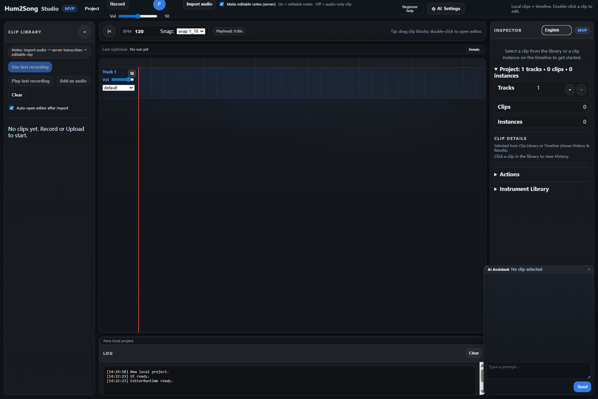

# Hum2Song

Turn a short **hum or vocal clip** into **MIDI and synthesized audio**. This repo runs a **local web app**: **Hum2Song Studio** at `/ui`, plus a **REST API**.

**[中文版 README_CHS.md](README_CHS.md)**

<p align="center">
  
  <br>
  <em>Hum2Song Studio — record or import a clip, edit in the piano roll, then optimize.</em>
</p>

---

## Windows: three helper scripts (repo root)

Double-click or run these **from the project folder** in Command Prompt / PowerShell (order matters):

| Script | What it does |
|--------|----------------|
| **[`beginner_install_audio_deps.bat`](beginner_install_audio_deps.bat)** | Tries to install **FFmpeg** and **FluidSynth** via **winget** / **Chocolatey** (needs one of those). Does **not** install Python or a SoundFont. If Chocolatey was just installed, **open a new terminal** and run it again. |
| **[`beginner_setup.bat`](beginner_setup.bat)** | Creates **`venv`** (if needed) and runs **`pip install -r requirements.txt`**. Requires **Python 3.11+** on `PATH` (`python` or `py`). |
| **[`beginner_launch.bat`](beginner_launch.bat)** | Starts the server like **`python scripts/beginner_launch.py --open`** (browser opens when ready). Extra args pass through, e.g. `beginner_launch.bat --reload`. |

You still need: **Python 3.11+**, a **SoundFont** at **`assets/piano.sf2`** ([`assets/README.txt`](assets/README.txt)), and optionally [`.env`](.env.example). If the scripts fail, follow **[docs/BEGINNER_FIRST_RUN_CHECKLIST.md](docs/BEGINNER_FIRST_RUN_CHECKLIST.md)**.

---

## Run it locally (commands)

Work from the **repository root**.

**1. You need:** Python **3.11+**, **FFmpeg** and **FluidSynth** on your `PATH`, and **`assets/piano.sf2`**. Optional: copy [`.env.example`](.env.example) to `.env`. Missing pieces → [manual install](docs/BEGINNER_FIRST_RUN_CHECKLIST.md#manual-install-soundfont-fluidsynth-ffmpeg).

**2. Install**

```powershell
python -m venv venv
.\venv\Scripts\activate
pip install -r requirements.txt
```

macOS / Linux: `python3 -m venv venv` then `source venv/bin/activate` — same `pip` line.

**3. Start**

```powershell
python scripts/beginner_launch.py
```

Use **`--open`** to open Studio in the browser; **`--reload`** for dev. Then open **[http://127.0.0.1:8000/ui](http://127.0.0.1:8000/ui)**.

Optional: `python scripts/beginner_preflight.py` checks your machine without starting the server.

---

## Studio in one minute

1. **Record** or **import** audio (e.g. WAV, MP3, M4A).
2. Edit in the **piano roll** if needed.
3. **Quick Optimize** (preset + goals) for AI-assisted cleanup; **Advanced** has LLM settings (optional).

**Keys:** **R** record · **P** play/pause · **S** stop playback (while playing).

---

## More documentation

Full topic index (API, LLM, Docker, tests, troubleshooting): **[docs/README.md](docs/README.md)**  
中文版索引：**[docs/README_CHS.md](docs/README_CHS.md)**
