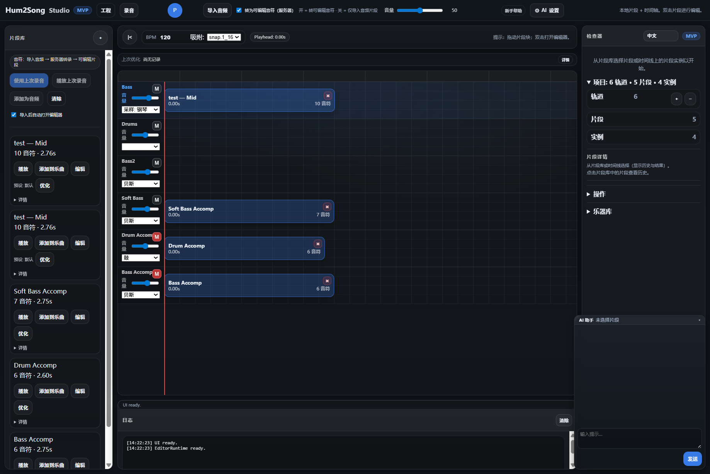

# Hum2Song

把短**哼唱或人声**转成 **MIDI 和合成音频**。本仓库在本地跑一个 **Web 应用**：**Hum2Song Studio**（`/ui`），并提供 **REST API**。

**[English README.md](README.md)**

<p align="center">
  
  <br>
  <em>Hum2Song Studio — 录音或导入片段，在钢琴卷帘中编辑，再一键优化。</em>
</p>

---

## Windows：三个一键辅助脚本（仓库根目录）

在资源管理器中双击，或在 **CMD / PowerShell** 里于**项目根目录**执行（建议按顺序）：

| 脚本 | 作用 |
|------|------|
| **[`beginner_install_audio_deps.bat`](beginner_install_audio_deps.bat)** | 尝试通过 **winget** / **Chocolatey** 安装 **FFmpeg** 与 **FluidSynth**（需已安装其一）。**不会**安装 Python 或音色库。若刚装好 Chocolatey，请**新开终端**再运行一次。 |
| **[`beginner_setup.bat`](beginner_setup.bat)** | 创建 **`venv`**（如需）并执行 **`pip install -r requirements.txt`**。需已在 `PATH` 中配置 **Python 3.11+**（`python` 或 `py`）。 |
| **[`beginner_launch.bat`](beginner_launch.bat)** | 启动服务，等价 **`python scripts/beginner_launch.py --open`**（就绪后自动打开浏览器）。可在后面跟参数，例如 **`beginner_launch.bat --reload`**。 |

仍需自备：**Python 3.11+**、**`assets/piano.sf2`** 音色库（见 [`assets/README.txt`](assets/README.txt)），可选复制 [`.env.example`](.env.example) 为 `.env`。脚本失败时请查阅 **[docs/BEGINNER_FIRST_RUN_CHECKLIST.md](docs/BEGINNER_FIRST_RUN_CHECKLIST.md)**。

---

## 本地运行（命令行）

请在**仓库根目录**操作。

**1. 准备：** Python **3.11+**、**FFmpeg**、**FluidSynth**、**`assets/piano.sf2`**。可选 `.env`。缺失项见 [手动安装](docs/BEGINNER_FIRST_RUN_CHECKLIST.md#manual-install-soundfont-fluidsynth-ffmpeg)。

**2. 安装**

```powershell
python -m venv venv
.\venv\Scripts\activate
pip install -r requirements.txt
```

macOS / Linux：`python3 -m venv venv`，`source venv/bin/activate`，同样执行 `pip`。

**3. 启动**

```powershell
python scripts/beginner_launch.py
```

可加 **`--open`**、**`--reload`**。浏览器打开 **[http://127.0.0.1:8000/ui](http://127.0.0.1:8000/ui)**。

可选：先运行 `python scripts/beginner_preflight.py` 做环境自检（不启动服务）。

---

## Studio 一分钟上手

1. **录音**或**导入**音频（如 WAV、MP3、M4A）。
2. 在 **钢琴卷帘**里按需修改。
3. **Quick Optimize**（预设 + 目标）；**Advanced** 含 LLM 等（可选）。

**快捷键：** **R** 录音 · **P** 播放/暂停 · **S** 停止播放（播放中）。

---

## 更多文档

完整主题索引（API、LLM、Docker、测试、排错等）：**[docs/README_CHS.md](docs/README_CHS.md)**  
English index: **[docs/README.md](docs/README.md)**
